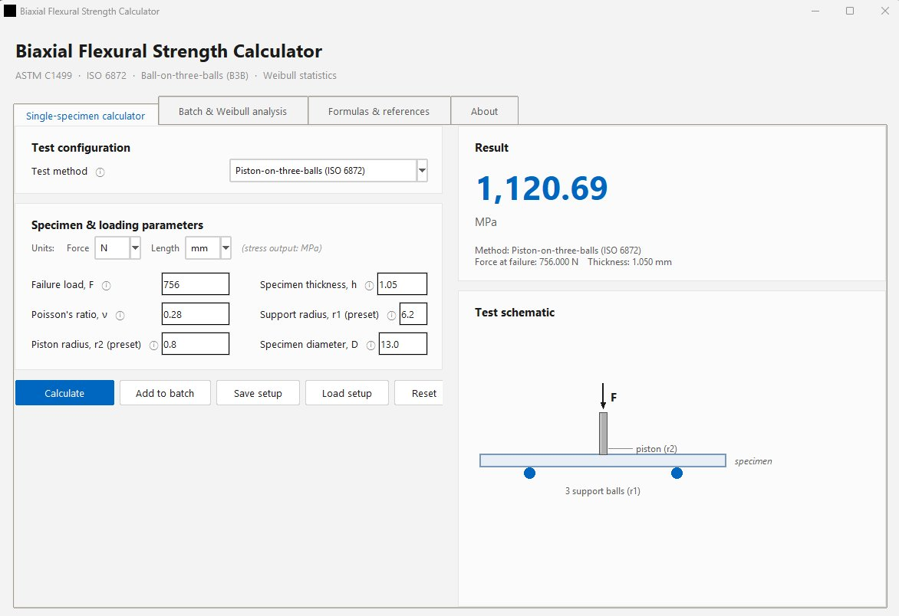
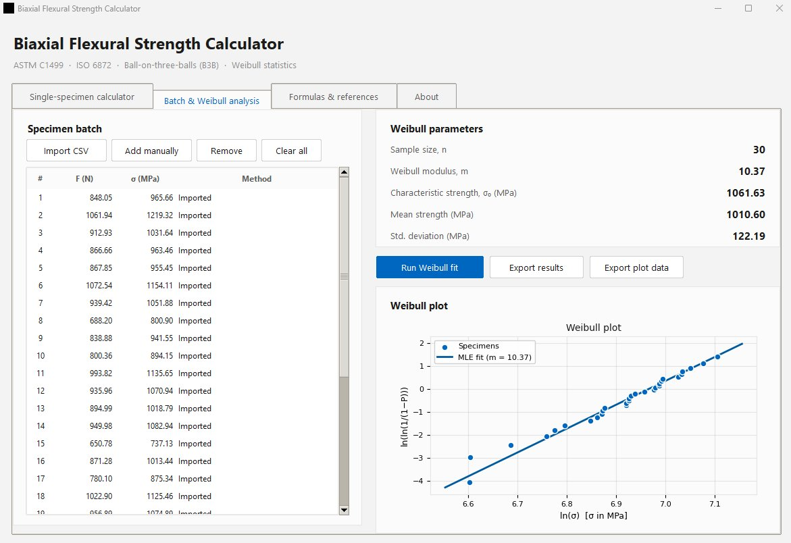

# Biaxial Flexural Strength Calculator

A Python desktop application for calculating the biaxial flexural strength of ceramic disc specimens. The tool implements the closed-form stress solutions for three standard test configurations and includes a two-parameter Weibull statistical module for batch analysis.

Supported test methods:

- Ring-on-Ring (ASTM C1499)
- Piston-on-three-balls (ISO 6872)
- Ball-on-three-balls (B3B)

### Single-specimen calculator



### Batch processing and Weibull analysis



## Features

- Single-specimen strength calculation from the failure load, specimen geometry and test fixture dimensions
- Selectable input units (N / kN for force; mm / m for length); stress output in MPa
- Fixture geometry save/load via `.json` files
- Batch processing with CSV import
- Two-parameter Weibull fit by maximum likelihood estimation (MLE)
- Linearised Weibull plot with MLE fit line overlay
- Export of results (specimen strengths and Weibull parameters) and plot data (axis values, fit line coordinates) to CSV for external plotting in Origin, MATLAB, etc.
- All implemented formulas documented in a dedicated tab within the application for independent verification

## Requirements

- Python 3.9+
- `tkinter` (included in standard CPython distributions)
- `numpy` and `matplotlib` (required for the Weibull analysis and plotting functionality)

```bash
pip install numpy matplotlib
```

The single-specimen calculator operates independently of numpy and matplotlib. If these packages are not installed, the Weibull tab is disabled and all other functionality remains available.

## Running the application

```bash
git clone https://github.com/<your-username>/biaxial-flexural-strength-calculator.git
cd biaxial-flexural-strength-calculator
python BiaxialStrengthCalculator.py
```

On Windows, the `.py` file can also be launched by double-clicking.

## Building a standalone executable

The application can be packaged as a standalone `.exe` (Windows), `.app` (macOS) or binary (Linux) using [PyInstaller](https://pyinstaller.org/):

```bash
pip install pyinstaller
```

```bash
pyinstaller --onefile --windowed --name BiaxialStrengthCalculator ^
  --exclude-module PyQt5 --exclude-module PyQt6 ^
  --exclude-module PySide2 --exclude-module PySide6 ^
  --exclude-module wx --exclude-module IPython ^
  BiaxialStrengthCalculator.py
```

On macOS/Linux, replace `^` with `\` for line continuation.

The output executable is placed in the `dist/` directory. The `--onefile` flag produces a single self-contained file; omitting it produces a faster-launching folder-based build instead. The `--windowed` flag suppresses the console window on Windows. The `--exclude-module` flags remove unused matplotlib backends that would otherwise add 20–30 MB to the output.

Expected executable size is approximately 70–90 MB (one-file) or 60–80 MB (folder). The bulk of this is numpy and matplotlib; the application code itself is around 50 KB. For a calculator-only build without Weibull plotting (~15 MB), uninstall numpy and matplotlib from the build environment prior to running PyInstaller.

## Usage

### Single-specimen calculation

1. Select the test method from the dropdown (Piston-on-three-balls is the default).
2. Set the appropriate units for force and length.
3. Enter the specimen and loading parameters. Each parameter has a tooltip (ⓘ) with a brief description.
4. Press **Calculate**.

For the Piston-on-three-balls configuration, the fixture geometry is pre-populated with default values of r1 = 6.2 mm (support ball circle radius) and r2 = 0.8 mm (piston contact radius; piston diameter 1.6 mm). These can be overwritten for other fixtures.

### Save/Load setup

The **Save setup** button writes the current test method, unit selections and all parameter values to a `.json` file. **Load setup** restores a previously saved configuration. This is intended for users who regularly test on the same fixture and want to avoid re-entering the geometry each time.

### Batch processing and Weibull analysis

The **Batch & Weibull analysis** tab accepts specimen data either by adding individual calculations from the first tab (**Add to batch**) or by importing a CSV file. The CSV importer reads the first column as strength in MPa and an optional second column as failure load in N. Non-numeric header rows are skipped.

After populating the batch, **Run Weibull fit** computes:

- Weibull modulus *m* and characteristic strength σ₀ via MLE
- Sample size, arithmetic mean and standard deviation
- A linearised Weibull plot (ln(ln(1/(1−P))) vs ln(σ)) with the MLE fit line

The median-rank estimator Pᵢ = (i − 0.5) / n is used for the empirical probability of failure.

### Exporting data

**Export results** writes the individual specimen strengths and the Weibull fit parameters to a single CSV file.

**Export plot data** writes the Weibull plot data to a separate CSV structured for direct import into external plotting software (Origin, MATLAB, Excel, etc.). The file contains two sections: (1) the specimen data points with rank, strength, probability of failure, ln(σ) and ln(ln(1/(1−P))), and (2) the MLE fit line as 100 interpolated coordinate pairs. Axis titles, units and the fit line equation are included as comment headers.

## Example dataset

An example dataset [`3YSZ_Dataset.csv`](3YSZ_Dataset.csv) is included, containing biaxial flexural strength values from 30 standard 3Y-TZP specimens measured in the lab using a piston-on-three-balls configuration. The file can be imported directly via the **Import CSV** button in the Batch & Weibull analysis tab.

## Formulas

The exact equations used by the calculator are documented in the **Formulas & references** tab within the application. A summary is provided below.

### Ring-on-Ring (ASTM C1499)

$$\sigma = \frac{3F}{2\pi h^2}\left[(1-\nu)\frac{D_S^2 - D_L^2}{2D^2} + (1+\nu)\ln\frac{D_S}{D_L}\right]$$

### Piston-on-three-balls (ISO 6872)

$$\sigma = -0.2387 \cdot \frac{F \cdot (X - Y)}{h^2}$$

$$X = (1 + \nu)\ln\left(\frac{r_2}{r_3}\right)^2 + (1 - \nu)\frac{r_2^2 - r_3^2}{2r_1^2}$$

$$Y = (1 + \nu)\left[1 + \ln\left(\frac{r_1}{r_3}\right)^2\right] + (1 - \nu)\frac{r_1^2 - r_3^2}{r_3^2}$$

where r₁ = support circle radius, r₂ = piston contact radius, r₃ = specimen radius (D/2).

### Ball-on-three-balls (B3B)

$$\sigma = f \cdot \frac{F}{h^2}$$

where *f* is a dimensionless geometry factor obtained from FEA (Börger, Supancic, Danzer). Typical values fall in the range 1.2–2.0.

### Two-parameter Weibull distribution

$$P(\sigma) = 1 - \exp\left[-\left(\frac{\sigma}{\sigma_0}\right)^m\right]$$

The modulus *m* is determined by Newton–Raphson iteration on the MLE score equation. The characteristic strength follows as σ₀ = ((1/n) Σ σᵢᵐ)^(1/m).

## Notes on sample size

EN 843-5 recommends a minimum of 30 specimens for a reliable estimate of *m*. With 10 specimens, the 90% confidence interval on *m* is approximately ±50%. Failure origins should be confirmed by fractography and specimens that failed outside the equibiaxial stress zone (e.g. edge-initiated fractures) should be excluded or flagged. For additively manufactured ceramics, the orientation of the print layers relative to the tensile surface should be reported.

## Contact

Feedback, bug reports and suggestions are welcome. Please open an issue on this repository or contact the author directly.

**Dr Thanos Goulas** — [thanosgoulas@outlook.com](mailto:thanosgoulas@outlook.com)

## License

This software is released under the MIT License. See [`LICENSE`](LICENSE) for details.

## Disclaimer

This software is provided as an engineering aid. The accuracy of calculated values depends on the validity of the input parameters and the underlying assumptions of the chosen test standard. The user is responsible for verifying results against the relevant standard (ASTM C1499, ISO 6872, etc.) and for confirming the appropriateness of the test method and statistical treatment for their specific application.

## Citation

If this tool is used in work that leads to a publication, a citation would be appreciated:

> Goulas, A. (2026). *Biaxial Flexural Strength Calculator* [Computer software]. https://github.com/thanosgoulas/biaxial-flexural-strength-calculator
